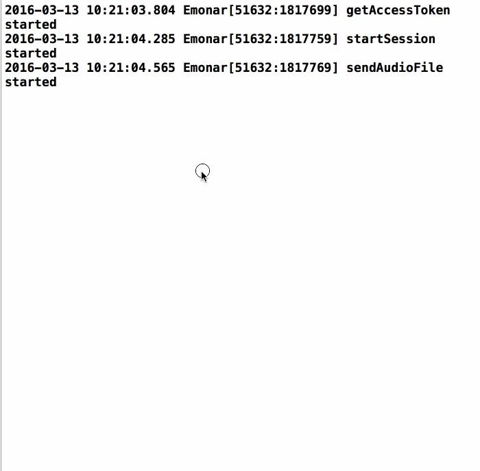
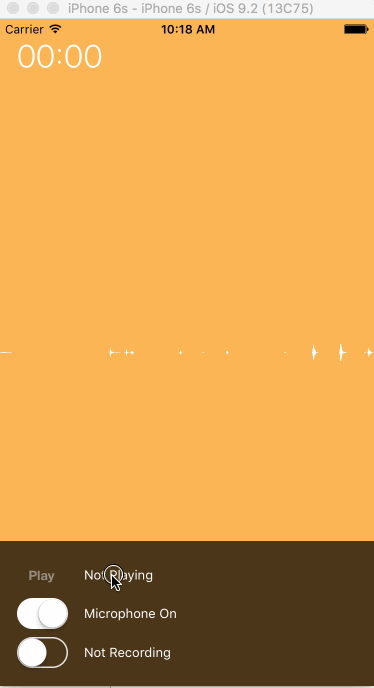
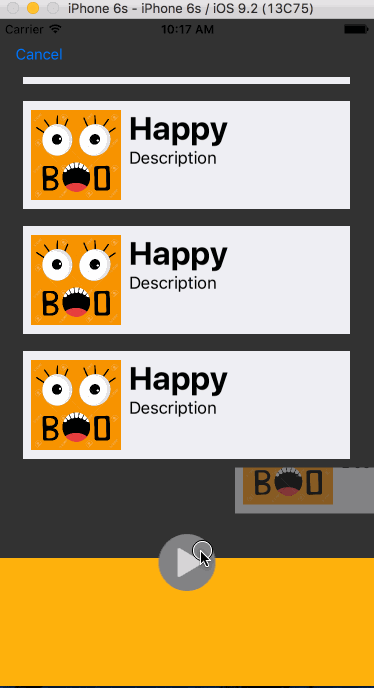

# Group Project  - *Emonar*

**Emonar** is a audio emotion analystics app that understands decodes speakers emotion while one is speaking [Beyond Verbal API](http://www.beyondverbal.com/emotions-analytics-api/).

Time spent: **X** hours spent in total

## User Stories

The following **required** functionality is completed:

- [x] User can record audio
- [ ] User can see emotion analystics every 20 seconds in real time.
- [ ] User can view past cached audio recording
- [ ] User can playback past audio recoding & seeing emotion analystics as well.

The following **optional** features are implemented:

- [ ] User can choose which part of audio to run emotion analystics
- [ ] User can use this for app-app call
- [ ] User can use this for app-phone call

Work Assignment:

- Main-UI : Jintao Zeng
- API-Integration : Gelei Chen
- Recoding-IO : Zhen Chen

UI - Sketch

02/11:

02/18 :

The following **additional** features are implemented:

- [ ] List anything else that you can get done to improve the app functionality!

Please list two areas of the assignment you'd like to **discuss further with your peers** during the next class (examples include better ways to implement something, how to extend your app in certain ways, etc):

1. 
2. 

## Model Class/ Data Schema

1. LoginToken:NSObject
  1. access_token:String
  2. token_type:String
  3. expires_in:NSNumber
2. User:NSObject
  1. session:String
  2. username:String
  3. password:String
3. Analysis:NSObject
  1. recordingId:String
  2. result:Analysis_result
  3. status:String
4. Analysis_result:NSDictionary
  1. analysisSegments:Analysis_result_analysisSegments
  2. analysisSummary:NSDictionary
  3. duration:String
  4. sessionStatus:String
5. Analysis_result_analysisSegments:NSDictionary
  1. analysis:NSDictionary
  2. duration:NSNumber
  3. offset:NSNumber

## Video Walkthrough 

Here's a walkthrough of implemented user stories:

GIF created with [LiceCap](http://www.cockos.com/licecap/).

## Notes

Describe any challenges encountered while building the app.

## License

Copyright [yyyy] [name of copyright owner]

Licensed under the Apache License, Version 2.0 (the "License");
you may not use this file except in compliance with the License.
You may obtain a copy of the License at

http://www.apache.org/licenses/LICENSE-2.0

Unless required by applicable law or agreed to in writing, software
distributed under the License is distributed on an "AS IS" BASIS,
WITHOUT WARRANTIES OR CONDITIONS OF ANY KIND, either express or implied.
See the License for the specific language governing permissions and
limitations under the License.
